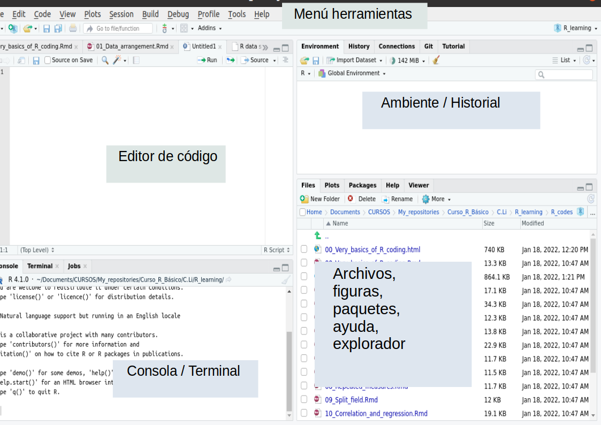
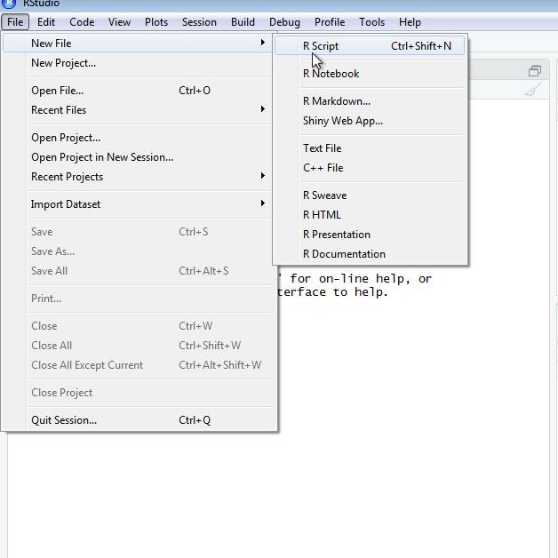
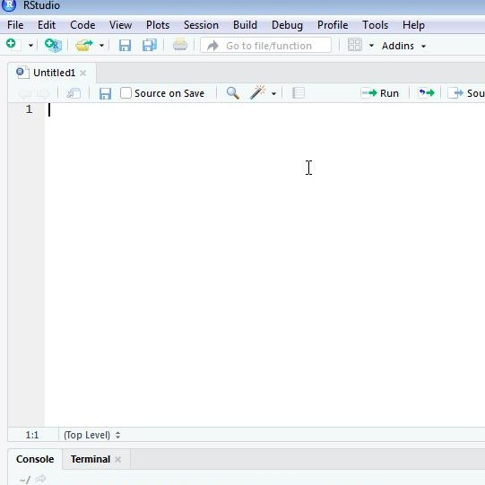
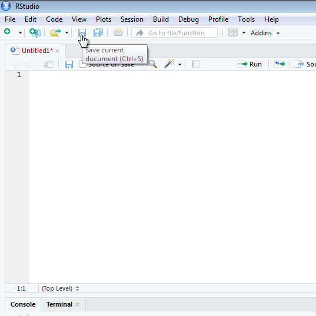
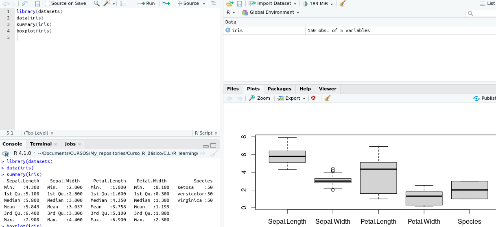
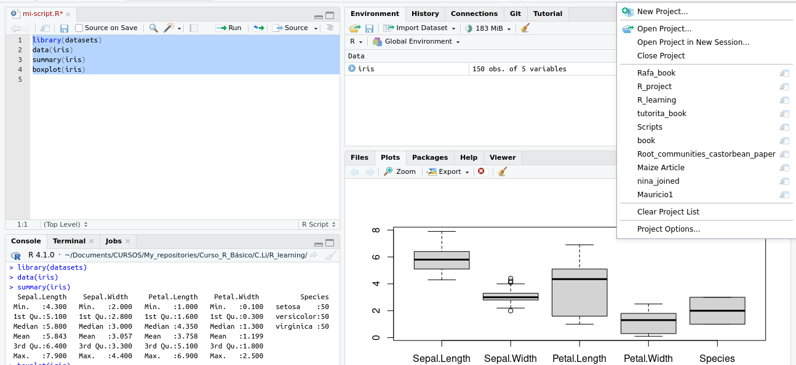
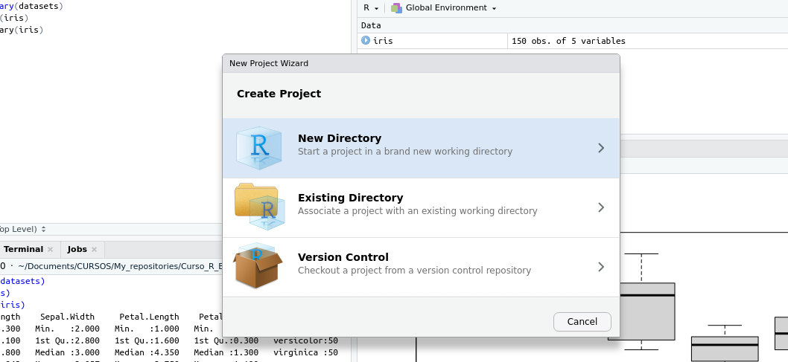
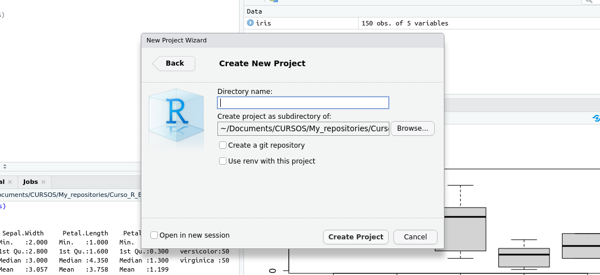

## Generalidades de R — Clase 1

- **¿Qué es R y por qué usarlo?**
- **RStudio y paneles**
- **Configuración del ambiente de trabajo y Scripts**
- **Directorios y sesión**
- **Áreas de trabajo y Proyectos**
- **Instalación y carga de paquetes**
- **Tipos de objetos, tipos de datos y estructuras de datos**
- **Funciones**

## ¿Qué es R?

- R es un lenguaje de programación **enfocado en estadística y análisis de datos**
- Fue creado por estadísticos como un ambiente interactivo para el análisis de datos
- Puede guardar su trabajo como una secuencia de comandos (*script*) que se puede ejecutar fácilmente en cualquier momento
- Otros programas (C, Java, Python) también pueden hacer cálculos estadísticos, pero R fue diseñado específicamente para eso

## Un poco de historia...

- R proviene del lenguaje **S**, creado en los Laboratorios Bell (EE.UU.) — los mismos que inventaron el transistor, el láser y Unix
- **Ross Ihaka** y **Robert Gentleman** (Universidad de Auckland, NZ) crearon una implementación libre y gratuita de S
- El trabajo inició en **1992** y la primera versión estable llegó en **2000**
- Hoy es mantenido por el *R Development Core Team*, con especialistas de todo el mundo
- R tiene **Licencia Pública GNU** — puede usarse para fines personales, académicos o comerciales sin restricciones

## ¿Por qué usar R?

1. Gratuito y de código abierto
2. Corre en Windows, Mac OS y UNIX/Linux — scripts compatibles entre plataformas
3. Comunidad grande, creciente y activa
4. Acceso temprano a nuevas metodologías publicadas como paquetes
5. Miles de paquetes en **CRAN**, **GitHub** y **Bioconductor**: ecología, biología molecular, ciencias sociales, geografía...

## RStudio

RStudio es nuestra plataforma de trabajo. Provee un editor visual e interactivo para crear y editar *scripts*, además de otras herramientas útiles.

{width="300px" fig-align="center"}

## Paneles de RStudio

:::: {.columns}
::: {.column width="50%"}
**Panel superior izquierdo**

Editor de código — aquí se escriben y editan los scripts

**Panel superior derecho**

*Environment* e *History* — objetos activos e historial de scripts
:::
::: {.column width="50%"}
**Panel inferior izquierdo**

Consola de R — donde se ejecutan los códigos

**Panel inferior derecho**

*Files* · *Plots* · *Packages* · *Help* · *Viewer*
:::
::::

## *Scripts*

Una de las grandes ventajas de R es que los códigos e instrucciones se guardan en *scripts*, que se pueden editar y reutilizar.

::: {layout-ncol=2}


:::

Para iniciar un nuevo script: *Archivo → Nuevo Archivo → R Script*

## Estructura recomendada de un *script*

```{r, eval=FALSE}
# Título / descripción del script

library(datasets)   # primero: carga de paquetes
data(iris)          # segundo: carga de datos

summary(iris)       # análisis
boxplot(iris)       # gráficas
```

- El símbolo `#` indica un comentario — R lo ignora al ejecutar
- Carguen siempre paquetes y datos **al principio** del script
- Nombres de archivos: minúsculas, sin espacios → `mi_script.R`

## Abriendo un *script*

Pueden abrir y ejecutar scripts en R con la función `source()`:

```{r, eval=FALSE}
source("C:/mi_script.R")
```

O bien: *File → Open File* y buscar en sus carpetas.

### Comentarios

Siempre inicien con comentarios descriptivos. Usen `#` para que R los ignore:

```{r, eval=FALSE}
# Este es mi código
data(iris)
# Aquí termina el código
```

## Cómo ejecutar comandos

{width="300px" fig-align="center"}

- Ejecutar línea actual: `Ctrl + Enter` (Windows/Linux) · `Cmd + Return` (Mac)
- Ejecutar todo el script: botón *Run* (esquina superior derecha del editor)
- Guarden con un nombre descriptivo, ej. `mi_script.R`

## Ejemplo: corriendo el código

```{r, eval=FALSE}
library(datasets)
data(iris)
summary(iris)
boxplot(iris)
```

{width="320px" fig-align="center"}

## Directorio de trabajo

El *directorio de trabajo* es el lugar donde R busca archivos para importar y donde guarda los resultados.

```{r, eval=FALSE}
getwd()                          # ver directorio actual
setwd("/home/steph/Desktop/")    # establecer directorio
list.files()                     # archivos en el directorio
list.dirs()                      # carpetas en el directorio
```

::: {.callout-tip}
**Mejor práctica:** usar **Proyectos de R** en lugar de `setwd()` — el directorio se configura automáticamente al abrir el proyecto.
:::

## Sesión de R

Los objetos y funciones de R se almacenan en la **memoria** de la computadora. Cada vez que ejecutamos R, iniciamos una *sesión*.

- Los objetos creados permanecen solo en esa sesión
- Las sesiones no se comparten entre sí
- Al cerrar R, puede guardarse todo en un archivo **`.Rdata`**

```{r, eval=FALSE}
ls()    # lista todos los objetos en la sesión actual
```

::: {.callout-warning}
No se recomienda guardar el espacio de trabajo completo — genera confusión entre proyectos y ocupa mucho espacio en disco. Mejor exportar solo lo necesario.
:::

## *Proyecto* de R (.Rproj)

:::: {.columns}
::: {.column width="55%"}
- Identifica todos los archivos y contenido asociados a un trabajo
- Al crear un proyecto, las carpetas quedan **vinculadas directamente** a él
- El directorio de trabajo se establece automáticamente
- Un proyecto por cada curso, artículo o análisis
:::
::: {.column width="45%"}
{width="95%"}

{width="95%"}
:::
::::

## Crear un proyecto

{width="300px" fig-align="center"}

## Instalación de paquetes

- Muchos desarrolladores crean *paquetes* con funcionalidades adicionales
- Disponibles en **CRAN**, **GitHub** y **Bioconductor**

```{r, eval=FALSE}
install.packages("tidyverse")   # instalar desde CRAN
```

En RStudio: pestaña *Packages → Install*. Para cargar en cada sesión:

```{r, eval=FALSE}
library(tidyverse)
```

::: {.callout-important}
Los paquetes se instalan **una sola vez**, pero se cargan **en cada sesión nueva**.
:::

## Instalación: versiones de desarrollo y dependencias

Para paquetes en GitHub (versión en desarrollo):

```{r, eval=FALSE}
devtools::install_github("rstudio/rmarkdown")
```

Los `::` llaman la función de un paquete sin cargarlo permanentemente en la sesión.

::: {.callout-note}
**Dependencias:** instalar `tidyverse` instala varios paquetes a la vez. Al cargarlo con `library()`, también se cargan sus dependencias automáticamente.
:::

## Tipos de objetos en R

La información en R se estructura en forma de objetos, visibles en el panel *Environment*:

```{r}
a     <- 1                                                 # escalar
letra <- "a"                                               # caracter
b     <- c(1, 2, 3)                                        # vector
c     <- matrix(1:10)                                      # matriz
d     <- data.frame(Especie=c("A","B"), Long=c(1,2))       # dataframe
e     <- list(c(1:20), c(1:10))                            # lista
```

## Definiendo variables

- Usamos `<-` para asignar valores a las variables
- También puede usarse `=`, pero **no se recomienda**: en R el `=` implica igualdad lógica y puede causar confusiones

```{r}
a <- 1
a             # evaluar imprime el valor
print(a)      # forma explícita de imprimir
```

## Visualizando variables asignadas

Los objetos declarados aparecen en el panel **Environment** (superior derecho). Desde ahí pueden verse el tipo y tamaño de cada objeto, o hacer clic para explorar tablas y listas.

Si se intenta usar un objeto que no existe en la sesión, R devuelve un error:

`Error: object 'f' not found`

::: {.callout-note}
Con `ls()` se obtiene una lista con los nombres de todo lo guardado en la sesión actual.
:::

## Tips para nombrar variables

:::: {.columns}
::: {.column width="50%"}
**Sí**

- Empezar con letra: `mi_var`
- Sin espacios: `longitud_total`
- Minúsculas + guión bajo `_`
- Nombres descriptivos y significativos
:::
::: {.column width="50%"}
**No**

- Números al inicio: `1especie`
- Con espacios: `mi dato`
- Guiones medios: `mi-dato`
- Sobreescribir funciones: `mean <- 5`
- Caracteres especiales: `- ; . @ ?`
:::
::::

## Guardar el espacio de trabajo

Los objetos permanecen en el espacio de trabajo hasta que finaliza la sesión. Al salir, R pregunta si desean guardarlo (archivo `.Rdata`).

::: {.callout-warning}
**No recomendado:** sin organización por proyectos, es muy difícil darle seguimiento a los objetos guardados y ocupa mucho espacio en disco.
:::

::: {.callout-tip}
**Recomendado:** un proyecto por cada trabajo o tarea, decidiendo explícitamente qué exportar y qué no.
:::

## Exportar objetos de R

```{r, eval=FALSE}
library(readr)
write_tsv(d, "data.tsv")          # separado por tabs
write.table(d, "data.txt", sep="\t")
write_csv(d, "data.csv")          # separado por comas
```

## Exportar objetos: formato nativo de R

Para guardar objetos conservando su estructura en R:

```{r, eval=FALSE}
saveRDS(d, "data.RDS")
```

Para cargar el objeto nuevamente:

```{r, eval=FALSE}
readRDS("data.RDS")
```

::: {.callout-note}
A diferencia de los formatos de texto, `saveRDS` conserva la clase y estructura del objeto (factores, listas, etc.)
:::

## Tipos de datos

La función `class()` determina qué tipo de objeto tenemos:

```{r}
a <- 5
class(a)
```

| Tipo | En R | Ejemplo |
|---|---|---|
| Numérico | `numeric` | `5.1` |
| Entero | `integer` | `4L` |
| Texto | `character` | `"hola"` |
| Factor | `factor` | Bajo / Medio / Alto |
| Lógico | `logical` | `TRUE`, `FALSE` |
| Perdido | `NA` | `NA` |
| Vacío | `NULL` | `NULL` |

## Para tener en cuenta...

::: {.callout-note}
**`character`** — El tipo más flexible. Siempre entre comillas: `"texto"`. Puede contener letras, números, espacios y símbolos especiales.
:::

::: {.callout-warning}
**`factor`** — Dato numérico representado con etiquetas (niveles). Los niveles se ordenan **alfabéticamente** por defecto. Puede causar confusión: a veces se comporta como carácter y otras veces no — fuente común de errores.
:::

::: {.callout-important}
**`NA` vs `NULL`** — `NULL` aparece cuando R intenta recuperar algo que no existe. `NA` representa explícitamente un **dato faltante** y puede surgir de operaciones que no pudieron completarse.
:::

## Coerción de datos

En R los datos pueden ser *coercionados* — forzados a transformarse de un tipo a otro:

:::: {.columns}
::: {.column width="50%"}
```{r}
a <- 5
as.character(a)
as.factor("medio")
```
:::
::: {.column width="50%"}
| Función | Convierte a |
|---|---|
| `as.integer()` | Entero |
| `as.numeric()` | Numérico |
| `as.character()` | Texto |
| `as.factor()` | Factor |
| `as.logical()` | Lógico |
:::
::::

## Tipos de estructura de datos

Los datos se estructuran de distintas formas. `class()` también identifica la estructura:

:::: {.columns}
::: {.column width="50%"}
**Homogéneas** (un solo tipo de dato)

- **Vector** — 1 dimensión
- **Matriz** — 2 dimensiones
:::
::: {.column width="50%"}
**Heterogéneas** (tipos mixtos)

- **Lista** — 1 dimensión
- **Data frame** — 2 dimensiones
:::
::::

## Vectores

Colecciones de uno o más datos del **mismo tipo**. No es posible mezclar tipos:

```{r}
colores <- c("red", "black", "blue")
is.vector(colores)
class(colores)
```

## Vectorización

Las operaciones aritméticas y relacionales se aplican a **cada elemento** del vector automáticamente:

```{r}
un_vector <- c(1:10)
un_vector * 10
un_vector + 1
un_vector + un_vector
```

## Matrices y arreglos

- Vectores multidimensionales — deben contener un **solo tipo** de datos
- Una matriz tiene **2 dimensiones**; un arreglo (*array*) puede tener `n` dimensiones

```{r}
matri <- matrix(1:20, nrow=3, ncol=4)
dim(matri)
matri
```

## Operaciones con matrices

```{r}
matri * 2
```

## Transponer una matriz

Rotar la matriz 90° con la función `t()`:

```{r}
t(matri)
```

## Listas

Las listas son **heterogéneas**: cada elemento puede ser de distinto tipo o clase:

```{r}
un_vector  <- 1:20
una_matriz <- matrix(1:20, nrow=2)
una_df     <- data.frame("numeros"=1:3, "letras"=c("a","b","c"))
una_lista  <- list("vec"=un_vector, "mat"=una_matriz, "df"=una_df)
str(una_lista)
```

## Coercionando entre estructuras

```{r}
df_transpuesta <- t(una_df)
class(df_transpuesta)
```

La función `t()` cambia la clase a matrix. Para conservar el dataframe:

```{r}
df_transpuesta <- as.data.frame(t(una_df))
class(df_transpuesta)
```

## Funciones

- Ya usamos varias funciones: `library()`, `write_csv()`..
- La **sintaxis** de R requiere paréntesis para evaluar funciones
- R incluye muchas funciones por defecto; otras vienen en paquetes

```{r}
log(a)
sqrt(a)
args(log)
```

## Funciones: argumentos

```{r, eval=FALSE}
help("log")
?log
```

- Argumentos con `=` en la ayuda son **opcionales** — tienen valor por defecto
- Ejemplo: `log` usa `base = exp(1)` por defecto (logaritmo natural)

```{r}
log(x=8, base=2)   # argumentos por nombre
log(8, 2)          # argumentos por posición — mismo resultado
```

En las funciones sí se usa `=`, no `<-`, para especificar argumentos.

## Funciones: operadores aritméticos (sin paréntesis):

```{r}
a + a
a - 2
1 * pi
2 / 3
4 ^ a
```

## Funciones: crear las tuyas (1)

Es posible declarar funciones propias. Por ejemplo, si quisiéramos definir el promedio:

```{r}
average <- function(x) { sum(x) / length(x) }
x <- 1:100
average(x)
mean(x)       # comparamos con la función de R base
```

Al compararlas obtenemos el mismo resultado.

## Funciones: crear las tuyas (2)

La estructura general de una función en R es:

```{r, eval=FALSE}
nombre <- function(argumentos) {
  operaciones
}
```

- Primero se declara el nombre y los argumentos
- Luego las operaciones que realizará
- Lo importante: hemos declarado un **nuevo objeto** de tipo función en nuestra sesión

## Referencias

::: {.nonincremental}
- Irizarry, R.A. (2019). *Introduction to Data Science*. Leanpub. [rafalab.dfci.harvard.edu/dsbook](https://rafalab.dfci.harvard.edu/dsbook)
- Wickham, H. & Grolemund, G. (2017). *R for Data Science*. O'Reilly. [r4ds.had.co.nz](https://r4ds.had.co.nz)
- Bosco Mendoza, J. (2019). *R para principiantes*. [bookdown.org/jboscomendoza/r-principiantes4](https://bookdown.org/jboscomendoza/r-principiantes4)
- CRAN — Comprehensive R Archive Network: [cran.r-project.org](https://cran.r-project.org)
- RStudio Education: [education.rstudio.com](https://education.rstudio.com)
:::
