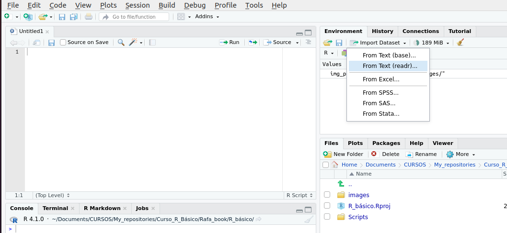
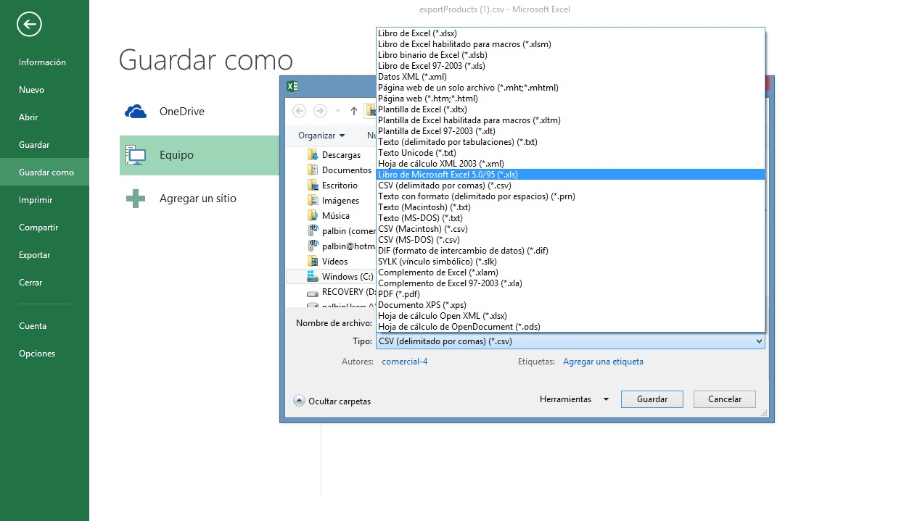

## Datos y funciones en R — Clase 2

- ***Dataframes***: qué son y cómo explorarlos
- **El operador `$`**
- **Subconjuntos básicos**
- **Funciones básicas útiles**
- **Tratando con datos `NA`**
- **Importando datos a R**
- **Ejercicios**

---

## ¿Qué es un *dataframe*?

La forma más común de almacenar datos en R. Piénsenlo como una **tabla de Excel**:

- Cada **fila** = una observación
- Cada **columna** = una variable
- Puede mezclar distintos tipos de datos (números, texto, factores)

```{r}
data(ToothGrowth)
str(ToothGrowth)
```

`str()` nos muestra la estructura: 60 filas, 3 variables.

---

## Exploración básica del *dataframe*

```{r}
head(ToothGrowth)      # primeras 6 filas
```

```{r}
dim(ToothGrowth)       # filas y columnas
```

::: {.callout-tip}
`head()`, `dim()` y `str()` son los tres primeros comandos que siempre debes usar cuando tienes datos nuevos.
:::

---

## Crear un *dataframe* propio

```{r}
estudiantes <- data.frame(
  nombre = c("Ana", "Clara", "Sofy"),
  nota   = c(10, 9, 7),
  grupo  = c("A", "A", "B"))

estudiantes
```

```{r}
colnames(estudiantes)   # nombres de las columnas
```

---

## El operador `$`

Es la forma más directa de acceder a **una columna**:

```{r}
estudiantes$nombre
estudiantes$nota
```

::: {.callout-tip}
En RStudio: escribe `estudiantes$` y presiona **Tab** — aparecen los nombres de las columnas automáticamente.
:::

---

## `$` también funciona para crear columnas

```{r}
estudiantes$aprobado <- c("Sí", "Sí", "Sí")
estudiantes
```

Y para modificar valores:

```{r}
estudiantes$nota[2] <- 10
estudiantes
```

---

## Subconjuntos: por posición con `[`

La sintaxis es `datos[filas, columnas]`:

```{r}
estudiantes[1, ]        # primera fila completa
estudiantes[, 2]        # segunda columna completa
estudiantes[1, 2]       # fila 1, columna 2
```

---

## Subconjuntos: por nombre de columna

```{r}
estudiantes[c("nombre", "nota")]
```

```{r}
estudiantes[, -1]       # excluir la primera columna
```

::: {.callout-note}
El signo **`-`** delante del número excluye esa posición en lugar de seleccionarla.
:::

---

## Funciones básicas: `sort` y `order`

```{r}
sort(estudiantes$nota)                        # de menor a mayor
sort(estudiantes$nota, decreasing = TRUE)     # de mayor a menor
```

```{r}
order(estudiantes$nota)    # devuelve las posiciones en orden
```

::: {.callout-note}
`sort()` reordena los **valores**. `order()` devuelve las **posiciones** — útil para ordenar tablas completas.
:::

---

## Funciones básicas: `max`, `min`, `mean`, `sum`

```{r}
max(estudiantes$nota)
min(estudiantes$nota)
mean(estudiantes$nota)
sum(estudiantes$nota)
```

---

## Funciones básicas: `which.max` y `which.min`

```{r}
which.max(estudiantes$nota)                    # posición del máximo
estudiantes[which.max(estudiantes$nota), ]     # fila completa
```

```{r}
which.min(estudiantes$nota)                    # posición del mínimo
estudiantes[which.min(estudiantes$nota), ]     # fila completa
```

---

## Tratando con datos `NA`

`NA` significa **dato faltante** (*Not Available*). Aparece cuando no hay información.

```{r}
notas_con_faltantes <- c(10, NA, 8, 9, NA, 7)
is.na(notas_con_faltantes)       # ¿cuáles son NA?
sum(is.na(notas_con_faltantes))  # ¿cuántos NA hay en total?
```

---

## NA: efecto en cálculos

```{r}
mean(notas_con_faltantes)                  # NA contamina el resultado
mean(notas_con_faltantes, na.rm = TRUE)    # ignorar los NA
```

::: {.callout-important}
Casi todas las funciones de R tienen el argumento `na.rm = TRUE` para ignorar los valores faltantes al calcular.
:::

---

## NA: eliminar filas con datos faltantes

```{r}
mi_data <- data.frame(
  alumno = c("Ana", "Luis", "Sofy", "Pedro"),
  nota   = c(9, NA, 8, NA))

mi_data[!is.na(mi_data$nota), ]  # filas sin NA
na.omit(mi_data)                  # equivalente
```

---

## Ejercicios

::: {.callout-note}
Trabajaremos con el dataset `iris`. Cárgalo con: `data(iris)`
:::

1. Usa `str()`, `head()` y `dim()` para explorar `iris`. ¿Cuántas filas y columnas tiene?

2. Accede a la columna `Sepal.Length` con `$`. ¿Cuál es su valor máximo y mínimo?

3. ¿Qué fila tiene el pétalo más largo (`Petal.Length`)? Usa `which.max()`.

---

## Ejercicios (cont.)

4. Crea una nueva columna `razon` en `iris` calculando `Sepal.Length / Petal.Length`.

5. Ordena `razon` de mayor a menor con `sort()`. ¿Cuál es el valor más alto?

6. ¿En qué posición está el valor mínimo de `razon`? Usa `which.min()` y accede a esa fila completa.

---

## Soluciones: ejercicios 1, 2 y 3

**1.** Explorar `iris`:

```{r}
str(iris)
dim(iris)    # 150 filas, 5 columnas
```

**2.** Máximo y mínimo de `Sepal.Length`:

```{r}
max(iris$Sepal.Length)
min(iris$Sepal.Length)
```

---

## Soluciones: ejercicio 3

**3.** Fila con el pétalo más largo:

```{r}
which.max(iris$Petal.Length)
iris[which.max(iris$Petal.Length), ]
```

---

## Soluciones: ejercicios 4, 5 y 6

**4.** Nueva columna `razon`:

```{r}
iris$razon <- iris$Sepal.Length / iris$Petal.Length
head(iris$razon)
```

**5.** Ordenar de mayor a menor:

```{r}
sort(iris$razon, decreasing = TRUE) |> head()
```

---

## Soluciones: ejercicio 6

**6.** Posición del mínimo y fila completa:

```{r}
which.min(iris$razon)
iris[which.min(iris$razon), ]
```

---

## Importando datos a R

Los formatos más comunes son:

:::: {.columns}
::: {.column width="50%"}
**CSV** (separado por comas):
```
species,body_mass_g,sex
Adelie,3750,male
Gentoo,5700,male
```

**TXT** (separado por tabulación):
```
species    body_mass_g   sex
Adelie     3750          male
Gentoo     5700          male
```
:::
::: {.column width="50%"}
**Puntos importantes:**

- La **primera fila** siempre es el encabezado
- Sin celdas vacías ni colores
- Sin fórmulas de Excel
- Nombres de columna sin espacios
:::
::::

---

## Directorio de trabajo

Antes de importar, debemos saber en qué carpeta estamos:

```{r, eval=FALSE}
getwd()                      # ver el directorio actual
setwd("C:/mi_carpeta")       # cambiar el directorio
```

::: {.callout-tip}
La opción más sencilla: guardar el archivo en la misma carpeta que el script y usar solo el nombre del archivo. Si usan **Proyectos de R** (`.Rproj`), el directorio se configura solo.
:::

---

## Paquetes para importar datos

**`readr`** — para archivos de texto (CSV, TSV, TXT):

| Función | Separador | Extensión |
|---|---|---|
| `read_csv` | Coma `,` | csv |
| `read_csv2` | Punto y coma `;` | csv |
| `read_tsv` | Tabulación | tsv, txt |
| `read_delim` | El que tú definas | cualquiera |

**`readxl`** — para archivos de Excel:

| Función | Formato |
|---|---|
| `read_excel` | Detecta automáticamente `.xls` y `.xlsx` |
| `read_xlsx` | Solo `.xlsx` |

---

## Sintaxis: importar CSV

Con **R base** (sin paquetes extra):

```{r, eval=FALSE}
datos <- read.csv("mi_archivo.csv")
datos <- read.csv("mi_archivo.csv", sep = ";")  # si usa punto y coma
```

Con el paquete **`readr`** (recomendado):

```{r, eval=FALSE}
library(readr)
datos <- read_csv("mi_archivo.csv")
datos <- read_csv2("mi_archivo.csv")   # si usa punto y coma
```

::: {.callout-note}
`read_csv()` (con guión bajo) es más rápida y consistente que `read.csv()` (con punto) de R base.
:::

---

## Sintaxis: importar Excel

```{r, eval=FALSE}
library(readxl)
datos <- read_excel("mi_archivo.xlsx")
datos <- read_excel("mi_archivo.xlsx", sheet = "Hoja2")  # hoja específica
datos <- read_excel("mi_archivo.xlsx", sheet = 2)        # por número
```

::: {.callout-tip}
Para Excel con varias hojas, usa el argumento `sheet =` con el nombre o número de la hoja.
:::

---

## Import Dataset: la opción visual

::: {style="display: flex; justify-content: center; align-items: center; height: 80%;"}
{width="85%"}
:::

---

## Import Dataset: cómo usarlo

Panel **Environment → Import Dataset**

- Selecciona el tipo: **From Text (readr)** para CSV/TXT · **From Excel** para xlsx
- Vista previa de los datos antes de importar
- Ajusta opciones (separador, encabezado, tipos de columna)
- **Genera el código automáticamente** — solo copiarlo al script

::: {.callout-tip}
Este es el método más fácil para empezar. Una vez que copies el código al script, no necesitas volver a usar la interfaz.
:::

---

## Tips para preparar archivos Excel

::: {style="display: flex; justify-content: center; align-items: center; height: 80%;"}
{width="75%"}
:::

---

## Tips para preparar archivos Excel

- Primera fila: **nombres de columnas** — sin espacios ni caracteres especiales
- Una observación por fila, una variable por columna
- Sin celdas combinadas ni filas de totales al final
- Sin colores, negritas ni formatos visuales
- Sin fórmulas — solo valores

::: {.callout-tip}
Guardar el Excel como `.csv` (*Archivo → Guardar como → CSV UTF-8*) antes de importar es la opción más sencilla y confiable.
:::

---

## ¡Practiquemos juntos!

Tenemos el archivo `datos_practica.csv` en nuestra carpeta de trabajo. Así lo cargamos:

```{r, echo=TRUE, eval=FALSE}
library(readr)
pinguinos <- read_csv("datos_practica.csv")
head(pinguinos)
```

```{r, echo=FALSE, eval=TRUE}
library(readr)
pinguinos <- read_csv("../Data/penguins_size.csv")
head(pinguinos)
```

---

## ¡Practiquemos juntos! (cont.)

```{r}
str(pinguinos)
dim(pinguinos)
```

---

## Exploremos los datos

```{r}
colnames(pinguinos)
```

```{r}
head(pinguinos, 10)
```

---

## Exploremos los datos: estadísticos básicos

```{r}
max(pinguinos$body_mass_g, na.rm = TRUE)
min(pinguinos$body_mass_g, na.rm = TRUE)
mean(pinguinos$body_mass_g, na.rm = TRUE)
```

---

## Exploremos los datos: ¿cuántos NA hay?

```{r}
sum(is.na(pinguinos))                      # total en toda la tabla
sum(is.na(pinguinos$body_mass_g))          # solo en una columna
```

---

## Exploremos los datos: ¿cuál es el más pesado?

```{r}
which.max(pinguinos$body_mass_g)
pinguinos[which.max(pinguinos$body_mass_g), ]
```

---

## Referencias

::: {.nonincremental}
- Irizarry, R.A. (2019). *Introduction to Data Science*. Leanpub. [rafalab.dfci.harvard.edu/dsbook](https://rafalab.dfci.harvard.edu/dsbook)
- Wickham, H. & Grolemund, G. (2017). *R for Data Science*. O'Reilly. [r4ds.had.co.nz](https://r4ds.had.co.nz)
- Bosco Mendoza, J. (2019). *R para principiantes*. [bookdown.org/jboscomendoza/r-principiantes4](https://bookdown.org/jboscomendoza/r-principiantes4)
- CRAN — Comprehensive R Archive Network: [cran.r-project.org](https://cran.r-project.org)
- RStudio Education: [education.rstudio.com](https://education.rstudio.com)
:::
