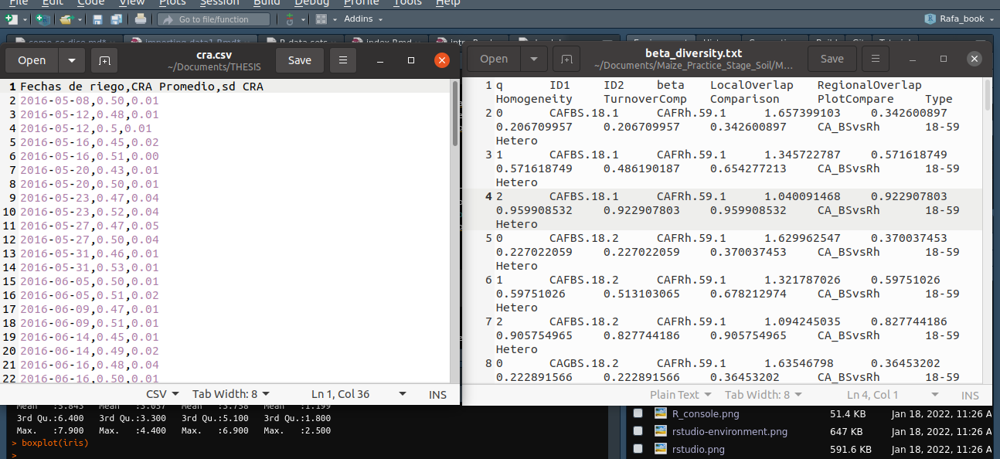

## Datos, funciones y operaciones en R — Clase 2

- ***Dataframes***: formas de acceso y subconjuntos
- **Importando datos a R**
- **Funciones básicas en R**
- **Familia `apply()`**
- **Estructuras de control**
- **Tratando con datos `NA`**

## *Dataframes*

La forma más común de almacenar datos en R. Son estructuras **bidimensionales** y **heterogéneas** (pueden contener distintos tipos de datos).

```{r}
data(ToothGrowth)
str(ToothGrowth)
```

`str()` nos muestra la estructura: 60 filas, 3 variables.

## *Dataframes*: exploración básica

```{r}
dim(ToothGrowth)
```

```{r}
head(ToothGrowth)
```

## *Dataframes*: crear uno

```{r}
df <- data.frame(
  "entero"  = 1:3,
  "factor"  = c("alto", "medio", "bajo"),
  "letras"  = as.character(c("a", "b", "c")))
df
```

```{r}
colnames(df)
```

`names()` y `colnames()` devuelven los nombres de las columnas.

## El operador `$`

Acceso a columnas de un *dataframe*:

```{r}
df$factor
class(df$factor)
is.vector(df$factor)
```

::: {.callout-tip}
Escribe `df$` y presiona **Tab** — RStudio autocompleta el nombre de la columna.
:::

## El operador `$` y `[[` en listas

```{r}
notas_estudiantes <- list(
  nombres        = c("Ana", "Clara", "Sofy"),
  id_estudiante  = c("i1", "i2", "i3"),
  notas          = c(10, 9, 7))

notas_estudiantes$nombres
notas_estudiantes[["nombres"]]
```

Ambas formas devuelven el mismo resultado.

## Acceso en matrices con `[`

```{r}
mat <- matrix(1:10, ncol = 5, nrow = 2)
mat[1, 1]     # fila 1, columna 1
mat[1, ]      # primera fila completa
mat[, 1]      # primera columna completa
```

::: {.callout-note}
El resultado de `mat[, 1]` es un **vector**, no una matriz.
:::

## Subconjuntos por posición

```{r}
mat[1:2, 2:4]          # filas 1-2, columnas 2-4
as.data.frame(mat)     # convertir matriz a dataframe
```

## Subconjuntos de *dataframes*

```{r}
evaluaciones <- as.data.frame(notas_estudiantes)
evaluaciones[c(1, 2)]    # primeras dos columnas
evaluaciones[1:2]        # equivalente
evaluaciones[, -1]       # excluir primera columna
```

## Subconjuntos: por nombre de columna

```{r}
evaluaciones[c("nombres", "notas")]
```

## Subconjuntos: operadores lógicos

| Operador | Comparación |
|---|---|
| `<` | Menor que |
| `<=` | Menor o igual que |
| `>` | Mayor que |
| `>=` | Mayor o igual que |
| `==` | Exactamente igual |
| `!=` | No es igual |
| `!` | Negación |
| `&`, `\|` | Y, O |

## Subconjuntos: filtros

```{r}
evaluaciones$notas > 8
mas_de_8 <- evaluaciones[evaluaciones$notas > 8, ]
mas_de_8
```

## Subconjuntos: condiciones múltiples

```{r}
evaluaciones[!(evaluaciones$notas > 8 &
               evaluaciones$nombres == "Clara"), ]
```

```{r}
evaluaciones[evaluaciones$nombres == "Sofy", ]
```

## Importando datos a R

Formatos más comunes de archivos de datos:

::: {.nonincremental}
- **CSV / TSV** — separados por coma (`,`), punto y coma (`;`) o tabulación (`\t`)
- **TXT** — texto plano con separadores
- **XLS / XLSX** — hojas de cálculo de Excel
:::

{width="330px"}

## Directorio de trabajo y rutas

Antes de importar, debemos saber en qué directorio nos encontramos:

1. `getwd()` / `setwd()` — ver y cambiar el directorio
2. Poner la **ruta completa** del archivo
3. Usar **Import Dataset** en el panel Environment

::: {.callout-tip}
La opción más sencilla: guardar el archivo en el directorio de trabajo y usar solo el nombre del archivo.
:::

## Descargando un archivo de la web

```{r, eval=FALSE}
download.file(
  url      = "https://archive.ics.uci.edu/ml/machine-learning-databases/iris/iris.data",
  destfile = "iris.data")
```

Para descargar **y** abrir al mismo tiempo:

```{r, warning=FALSE, message=FALSE}
library(readr)
iris_dat <- read_csv("https://archive.ics.uci.edu/ml/
                      machine-learning-databases/iris/iris.data")
```

## Funciones de importación: R base

```{r, eval=FALSE}
iris_data <- read.csv("iris.data", header = F)
iris_data <- read.delim("iris.data", header = F, sep = ",")
```

## Funciones de importación: readr

```{r, warning=FALSE, message=FALSE, eval=FALSE}
library(readr)
iris_data <- read_csv("iris.data",
                      col_names = c("Longitud.sepalo", "Ancho.Sepalo",
                                    "Longitud.Petalo", "Ancho.Petalo",
                                    "Especies"))
```

Usando ruta completa (archivo en carpeta `Data` del proyecto):

```{r}
data <- read_csv("../Data/penguins_size.csv")
```

## Import Dataset (interfaz visual)

:::: {.columns}
::: {.column width="55%"}
La opción más interactiva: panel **Environment → Import Dataset**

- Selecciona el tipo de archivo
- Vista previa antes de importar
- Genera el código automáticamente

::: {.callout-tip}
Para `.csv` y `.txt` usa **readr**; para Excel usa **readxl**.
:::
:::
::: {.column width="45%"}
{width="95%"}
:::
::::

## El paquete `readr`

| Función | Tipo de archivo | Extensión |
|---|---|---|
| `read_table` | Separado por espacios | txt |
| `read_csv` | Separado por comas | csv |
| `read_csv2` | Separado por punto y coma | csv |
| `read_tsv` | Separado por tabulación | tsv, txt |
| `read_delim` | Delimitador a definir | txt, csv, tsv |

## El paquete `readxl`

| Función | Formato | Extensión |
|---|---|---|
| `read_excel` | Detecta automáticamente | xls, xlsx |
| `read_xls` | Formato original | xls |
| `read_xlsx` | Formato nuevo | xlsx |

## Tips para archivos Excel

:::: {.columns}
::: {.column width="55%"}
- Evitar formatos visuales: colores, subrayados
- No dejar celdas vacías
- Evitar fórmulas en las celdas
- Guardar como `.csv` o `.txt` para importar más fácilmente: *Guardar como → tipo de formato*
:::
::: {.column width="45%"}
{width="95%"}
:::
::::

## Funciones básicas: `sort` y `order`

```{r}
sort(evaluaciones$notas)   # ordena los valores
order(evaluaciones$notas)  # devuelve los índices en orden
```

## Funciones básicas: `max`, `min` y `which`

```{r}
max(evaluaciones$notas)
which.max(evaluaciones$notas)   # posición del máximo
```

```{r}
min(evaluaciones$notas)
which.min(evaluaciones$notas)   # posición del mínimo
```

## Funciones básicas: `which`

`which` devuelve las posiciones donde una condición es `TRUE`:

```{r}
ind <- which(evaluaciones$nombres == "Ana")
ind
evaluaciones[ind, ]
```

## Funciones básicas: `match`

`match` devuelve los índices de coincidencia entre dos vectores:

```{r}
v1 <- c("Uvas", "Peras", "Mandarinas", "Plátanos", "Manzanas")
v2 <- c("Uvas", "Cerezas", "Mandarinas", "Naranjas", "Manzanas")
match(v1, v2)
match(c("Peras", "Plátanos"), v1)
```

## `match` en *dataframes*

```{r}
ind2  <- match(v1, v2)
frutas <- data.frame(persona1 = v1, persona2 = v2)
na.omit(frutas[ind2, ])    # na.omit() elimina filas con NA
```

## Funciones básicas: `%in%`

Devuelve un lógico: ¿está cada elemento del primer vector en el segundo?

```{r}
c("Peras", "Plátanos") %in% frutas$persona1
```

`match` e `%in%` pueden combinarse con `which` para obtener el mismo resultado:

```{r}
match(c("Peras", "Plátanos"), frutas$persona1)
which(frutas$persona1 %in% c("Peras", "Plátanos"))
```

## La familia `apply()`

Aplica una función a cada elemento de una estructura de datos.

| Función | Aplica sobre |
|---|---|
| `apply()` | Matrices y dataframes |
| `lapply()` | Listas → devuelve lista |
| `sapply()` | Listas → devuelve vector |
| `mapply()` | Múltiples vectores |

Las más usadas en este nivel son `apply()`, `lapply()` y `sapply()`.

## `apply()`

Aplica una función a todas las filas (`MARGIN = 1`) o columnas (`MARGIN = 2`) de una **matriz**:

```{r, eval=FALSE}
apply(X, MARGIN, FUN)
```

```{r}
matriz <- matrix(1:20, ncol = 5, nrow = 4)
apply(X = matriz, MARGIN = 2, FUN = sum)
colSums(matriz)    # equivalente
```

## `apply()`: múltiples funciones

```{r}
multiples.func <- function(x) {
  c(sum = sum(x), prom = mean(x), max = max(x))
}
apply(X = matriz, MARGIN = 2, FUN = multiples.func)
```

## Estructuras de control

Permiten controlar cómo se ejecuta el código según condiciones.

| Estructura | Descripción |
|---|---|
| `if`, `else` | Si... de otro modo |
| `for` | Repite para cada elemento |
| `while` | Repite mientras sea verdad |
| `break` | Interrumpe el bucle |
| `next` | Salta a la siguiente iteración |

## `if` / `else`

```{r}
if (10 > 2) { "Verdadero" } else { "Falso" }
if (10 < 2) { "Verdadero" } else { "Falso" }
```

La función `ifelse()` hace lo mismo de forma vectorizada:

```{r}
ifelse((10 > 2), "Verdadero", "Falso")
ifelse(evaluaciones$notas > 7, "Aprobado", "Reprobado")
```

## `for`

Ejecuta un bloque de código para **cada elemento** de un conjunto:

```{r}
un_vector <- 1:10
for (i in un_vector) {
  print(i * 2)
}
```

## `while`

Se ejecuta **mientras** una condición sea `TRUE`:

```{r}
umbral <- 3
valor  <- 0

while (valor < umbral) {
  print("Aún no llegas al umbral")
  valor <- valor + 1
}
```

## Tratando con datos `NA`: detectar

```{r, eval=FALSE}
data <- data.frame(
  x1 = c(NA, 5, 6, 8, 9),
  x2 = c(2, 4, NA, NA, 1),
  x3 = c(3, 6, 7, 0, 3),
  x4 = c("Hola", "algo", NA, "Chao", NA))

is.na(data)
is.na(data$x2)
which(is.na(data))
sum(is.na(data))        # total de NAs
```

## Tratando con datos `NA`: omitir y reemplazar

```{r, eval=FALSE}
mean(data$x1, na.rm = TRUE)       # ignorar NAs al calcular
data[complete.cases(data), ]      # filas sin ningún NA
na.omit(data)                     # equivalente

# Reemplazar con 0
data[is.na(data)] <- 0

# Reemplazar con promedio o mediana
data$x1[is.na(data$x1)] <- mean(data$x1, na.rm = TRUE)
data$x2[is.na(data$x2)] <- median(data$x2, na.rm = TRUE)
```

::: {.callout-note}
Para imputación más avanzada: paquetes **Hmisc**, **mice** o **rpart**.
:::

## Referencias

::: {.nonincremental}
- Irizarry, R.A. (2019). *Introduction to Data Science*. Leanpub. [rafalab.dfci.harvard.edu/dsbook](https://rafalab.dfci.harvard.edu/dsbook)
- Wickham, H. & Grolemund, G. (2017). *R for Data Science*. O'Reilly. [r4ds.had.co.nz](https://r4ds.had.co.nz)
- Bosco Mendoza, J. (2019). *R para principiantes*. [bookdown.org/jboscomendoza/r-principiantes4](https://bookdown.org/jboscomendoza/r-principiantes4)
- CRAN — Comprehensive R Archive Network: [cran.r-project.org](https://cran.r-project.org)
- RStudio Education: [education.rstudio.com](https://education.rstudio.com)
:::
