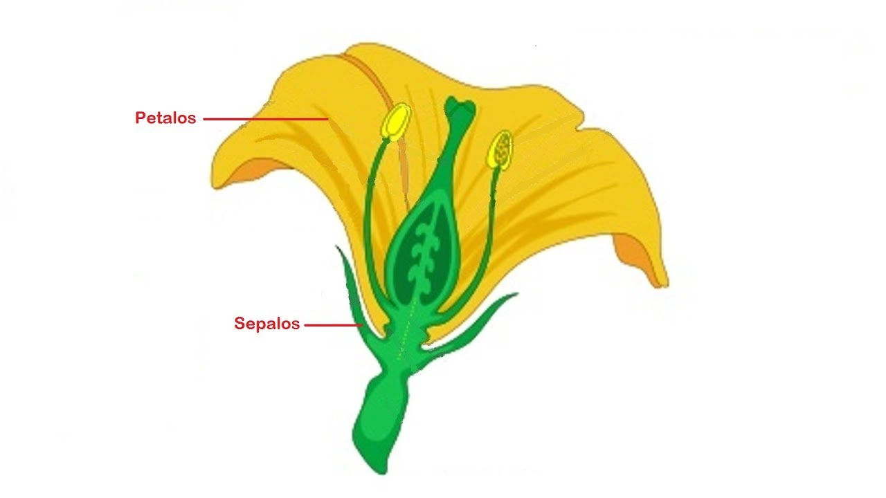
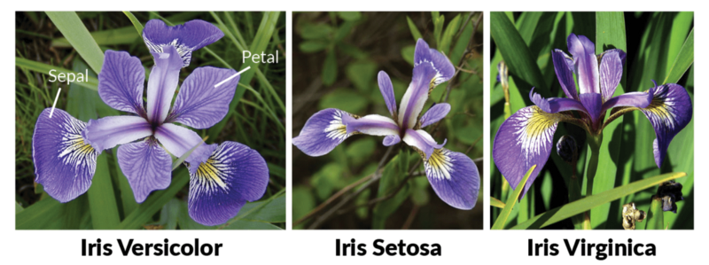

## Estadísticos básicos en R — Clase 3

- Estadísticos descriptivos
- Gráficos descriptivos
- Exploración de normalidad
- Correlación y Regresión lineal
- ANOVA (1 vía y 2 vías)
- Prueba de Tukey
- Otras pruebas

## Dataset de trabajo

Trabajaremos con el dataset `iris` — medidas de sépalos y pétalos de tres especies de flores.

```{r}
data(iris)
cols <- c("Largo_Sepalo", "Ancho_Sepalo", "Largo_Petalo",
          "Ancho_Petalo", "Especies")
colnames(iris) <- cols
str(iris)
```

## Dataset de trabajo

4 variables numéricas de respuesta y 1 factor (especie):

```{r}
dim(iris)
nrow(iris)
ncol(iris)
```

## Dataset de trabajo: especies

::: {style="display: flex; justify-content: center; gap: 30px; align-items: center; height: 75%;"}
{width="42%"}
{width="42%"}
:::

## Estadísticos descriptivos: `summary()`

`summary()` devuelve mínimo, máximo, promedio, mediana y rango intercuartil de cada variable:

```{r}
summary(iris)
```

## Estadísticos descriptivos: tendencia central

```{r}
mean(iris$Largo_Sepalo)
median(iris$Largo_Sepalo)
min(iris$Largo_Sepalo)
max(iris$Largo_Sepalo)
```

## Estadísticos descriptivos: cuantiles y dispersión

```{r}
quantile(iris$Largo_Sepalo, 0.25)                  # primer cuartil
quantile(iris$Largo_Sepalo, 0.75)                  # tercer cuartil
sd(iris$Largo_Sepalo)                              # desviación estándar
IQR(iris$Largo_Sepalo)                             # rango intercuartil
```

## Estadísticos descriptivos: variabilidad

```{r}
var(iris$Largo_Sepalo)                             # varianza
sd(iris$Largo_Sepalo) / mean(iris$Largo_Sepalo)    # coeficiente de variación
```

Para calcular la SD de todas las columnas numéricas:

```{r, eval=FALSE}
lapply(iris[, 1:4], sd)
```

## Gráficos descriptivos: boxplot

Variación del largo del sépalo por especie:

```{r, fig.width=4, fig.height=3.5, fig.align='center'}
boxplot(iris$Largo_Sepalo ~ iris$Especies)
```

## Gráficos descriptivos: ggbarplot

```{r, fig.width=5, fig.height=3.5, fig.align='center'}
library(ggpubr)
ggbarplot(data = iris, x = "Especies", y = "Largo_Sepalo",
          add = "mean_sd")
```

## Explorando normalidad

Antes de aplicar pruebas estadísticas es importante explorar si los datos siguen una **distribución normal** (gaussiana — forma acampanada y simétrica).

::: {.callout-important}
Muchas pruebas estadísticas **asumen normalidad**. Si los datos no son normales, se deben usar pruebas no paramétricas.
:::

Usaremos `Ancho_Sepalo` para estos ejemplos.

## Normalidad: histograma y densidad

:::: {.columns}
::: {.column width="50%"}
```{r, fig.height=5.8}
hist(iris$Ancho_Sepalo)
```
:::
::: {.column width="50%"}
```{r, fig.height=5.8}
plot(density(iris$Ancho_Sepalo))
```
:::
::::

## Normalidad: Q-Q plot

```{r, out.width='70%', fig.align='center'}
qqnorm(iris$Ancho_Sepalo)
qqline(iris$Ancho_Sepalo)
```

## Normalidad: `qqPlot` del paquete `car`

```{r, fig.align='center', out.width='65%'}
library(car)
qqPlot(iris$Ancho_Sepalo)
```

## Normalidad: prueba de Shapiro-Wilk

```{r}
shapiro.test(iris$Ancho_Sepalo)
```

::: {.callout-note}
**H₀:** los datos siguen una distribución normal.

**p-value = 0.1012 > 0.05** → no rechazamos H₀ → **los datos son normales**.

Si p-value < 0.05, los datos **no** serían normales.
:::

## Correlación: `cor.test()`

¿Existe relación entre el largo y el ancho del pétalo?

```{r}
cor.test(iris$Largo_Petalo, iris$Ancho_Petalo)
```

## Correlación: interpretando los resultados

:::: {.columns}
::: {.column width="55%"}
- **cor = +1**: correlación positiva perfecta
- **cor = -1**: correlación negativa perfecta
- **cor = 0**: sin correlación
- **p-value < 0.05**: correlación significativa
:::
::: {.column width="45%"}
::: {.callout-tip}
En los resultados anteriores, el **cor ≈ 0.96** y el **p-value < 0.05**.

Hay una correlación positiva y significativa entre largo y ancho del pétalo.
:::
:::
::::

## Correlación: función `cor()`

Solo devuelve el coeficiente, sin la prueba:

```{r}
cor(iris$Largo_Petalo, iris$Ancho_Petalo)             # Pearson (normales)
cor(iris$Largo_Petalo, iris$Ancho_Petalo,
    method = "spearman")                              # Spearman (no normales)
```

## Regresión lineal

Modelo que describe la relación lineal entre dos variables: **y = ax + b**

- **a** = pendiente, **b** = intercepto
- Debe aplicarse sobre datos normales

```{r, eval=FALSE}
modelo <- lm(Ancho_Petalo ~ Largo_Petalo, data = iris)
plot(modelo, which = 2)    # diagnóstico de normalidad
```

La variable de respuesta va al lado izquierdo de `~`, la explicativa al derecho.

## Regresión lineal: diagnóstico

```{r, echo=FALSE}
modelo <- lm(Ancho_Petalo ~ Largo_Petalo, data = iris)
plot(modelo, which = 2)
```

Pocos puntos fuera de la línea → asumimos normalidad.

## Regresión lineal: resumen del modelo

```{r}
summary(modelo)
```

## Regresión lineal: interpretando

::: {.callout-note}
De `summary(modelo)`:

- **Intercepto** = -0.3630, **pendiente** = 0.4157
- Ecuación: `Ancho_Petalo = 0.4157 × Largo_Petalo - 0.3630`
- **p-values < 0.05** → coeficientes significativos
- **R² ajustado ≈ 0.92** → el modelo explica el **92%** de la varianza
:::

## ANOVA (1 vía): supuestos

ANOVA compara las medias entre diferentes grupos. Supuestos:

1. **Independencia** — cada observación es independiente
2. **Normalidad** — los datos siguen distribución normal
3. **Homocedasticidad** — varianzas equivalentes entre grupos

Verificamos 2 y 3 con gráficos diagnóstico del modelo:

```{r, eval=FALSE}
modelo_ancho <- lm(Ancho_Sepalo ~ Especies, data = iris)
plot(modelo_ancho, which = c(1, 2))
```

## ANOVA (1 vía): gráficos diagnóstico

:::: {.columns}
::: {.column width="50%"}
```{r, echo=FALSE, fig.height=5.5}
modelo_ancho <- lm(Ancho_Sepalo ~ Especies, data = iris)
plot(modelo_ancho, which = 1)
```
:::
::: {.column width="50%"}
```{r, echo=FALSE, fig.height=5.5}
plot(modelo_ancho, which = 2)
```
:::
::::

::: {.callout-note}
**Residuals vs Fitted:** la línea roja debe ser aproximadamente horizontal — indica homocedasticidad.
**Q-Q:** los puntos deben seguir la línea diagonal — indica normalidad.
:::

## ANOVA (1 vía): resultado

```{r}
anova(modelo_ancho)
```

::: {.callout-note}
**p-value << 0.05** → rechazamos H₀ → las medias del ancho del sépalo **son diferentes entre especies**.
:::

## Prueba de Tukey

ANOVA dice que hay diferencias, pero no dice *entre cuáles grupos*. Tukey lo determina:

```{r}
fm1 <- aov(modelo_ancho)
TukeyHSD(fm1, "Especies", ordered = TRUE)
```

## Prueba de Tukey: grupos con `HSD.test`

```{r}
library(agricolae)
tuk <- HSD.test(fm1, "Especies", group = TRUE, console = FALSE)
tuk$groups
```

Las letras indican grupos significativamente diferentes entre sí.

## Prueba de Tukey: gráfica

::: {style="display: flex; justify-content: center; align-items: center; height: 80%;"}
```{r, echo=FALSE, fig.align='center', fig.height=4.5, fig.width=5.5}
library(ggpubr)
ggbarplot(data = iris, x = "Especies", y = "Ancho_Sepalo",
          fill = "Especies", add = c("mean_sd"), width = 0.4) +
  annotate(geom = "text",
           label = c("a", "c", "b"),
           x = c(1, 2, 3), y = c(4, 3.5, 3.7),
           size = 5, fontface = "bold") +
  theme_minimal() +
  theme(legend.position = "none",
        text = element_text(size = 12, color = "black", face = "bold"),
        axis.text = element_text(size = 12, color = "black", face = "bold"))
```
:::

## ANOVA (2 vías): introducción

Estudia la relación entre una variable dependiente **cuantitativa** y **dos factores** cualitativos.

- **Modelo aditivo:** `aov(respuesta ~ factor1 + factor2, data)`
- **Modelo con interacción:** `aov(respuesta ~ factor1 * factor2, data)`

::: {.callout-note}
Los grupos deben tener el **mismo número de réplicas**.
:::

Usaremos el dataset `ToothGrowth`: efecto de vitamina C (dosis y forma de administración) sobre el crecimiento de dientes.

## ANOVA (2 vías): preparar los datos

```{r}
data("ToothGrowth")
str(ToothGrowth)
```

`dose` aparece como numérica — la convertimos a factor:

```{r}
ToothGrowth$dose <- factor(ToothGrowth$dose,
                           levels = c(0.5, 1, 2),
                           labels = c("D0.5", "D1", "D2"))
head(ToothGrowth)
```

## Visualización: efecto de `supp`

```{r, echo=TRUE, fig.align='center', fig.height=4.2, fig.width=5}
boxplot(len ~ supp, data = ToothGrowth,
        col = c("lightblue", "lightcoral"),
        xlab = "Suplemento", ylab = "Longitud (mm)")
```

## Visualización: efecto de `dose`

```{r, echo=TRUE, fig.align='center', fig.height=4.2, fig.width=5}
boxplot(len ~ dose, data = ToothGrowth,
        col = c("lightgreen", "khaki", "lightsalmon"),
        xlab = "Dosis", ylab = "Longitud (mm)")
```

## Visualización: efecto combinado

```{r, echo=TRUE, fig.align='center', fig.height=4.2}
boxplot(len ~ dose:supp, data = ToothGrowth,
        col = rep(c("lightblue", "lightcoral"), 3),
        xlab = "Dosis : Suplemento", ylab = "Longitud (mm)")
```

## ANOVA (2 vías): interacción entre factores

::: {style="display: flex; justify-content: center; align-items: center; height: 80%;"}
```{r, echo=FALSE, fig.align='center', fig.height=4.2, fig.width=6}
ggline(ToothGrowth, x = "dose", y = "len", color = "supp",
       add = c("mean_se", "jitter"))
```
:::

Las líneas no paralelas sugieren una posible **interacción** entre `supp` y `dose`.

## ANOVA (1 vía): solo `supp`

```{r}
anova_supp <- lm(len ~ supp, data = ToothGrowth)
anova(anova_supp)
```

::: {.callout-note}
**p-value > 0.05** → `supp` por sí solo **no** tiene un efecto significativo sobre el crecimiento dental.
:::

## ANOVA (1 vía): solo `dose`

```{r}
anova_dose <- lm(len ~ dose, data = ToothGrowth)
anova(anova_dose)
```

::: {.callout-note}
**p-value < 0.05** → `dose` por sí sola **sí** tiene un efecto significativo sobre el crecimiento dental.
:::

## ANOVA (2 vías): modelos

```{r}
anova1 <- aov(len ~ supp + dose, data = ToothGrowth)   # aditivo
anova2 <- aov(len ~ supp * dose, data = ToothGrowth)   # interacción
summary(anova1)
```

## ANOVA (2 vías): modelo con interacción

```{r}
summary(anova2)
```

::: {.callout-note}
El modelo multiplicativo confirma una **interacción significativa** (p < 0.05) entre `supp` y `dose` — el efecto de un factor depende del otro.
:::

## Otras pruebas estadísticas

| Situación | Prueba paramétrica | Prueba no paramétrica |
|---|---|---|
| 2 grupos independientes | `t.test()` | `wilcox.test()` |
| 2 grupos pareados | `t.test(paired=TRUE)` | `wilcox.test(paired=TRUE)` |
| Más de 2 grupos | ANOVA | `kruskal.test()` |

```{r, eval=FALSE}
t.test(len ~ supp, data = ToothGrowth, paired = TRUE)
wilcox.test(len ~ supp, data = ToothGrowth, paired = TRUE)
kruskal.test(len ~ dose, data = ToothGrowth)
```

::: {.callout-note}
Otros paquetes útiles: **agricolae**, **vegan**, **emmeans** — con pruebas adicionales como Dunn, Duncan, Welch.
:::

## Ejercicio

Dataset: **`chickwts`** (R base) — peso de pollitos alimentados con seis tipos de dieta diferentes.

::: {.nonincremental}
1. Explora el dataset con `str()` y `summary()`
2. Calcula estadísticos descriptivos de `weight` (`mean`, `sd`, `min`, `max`)
3. Genera un **boxplot** de `weight` por `feed`
4. Verifica la normalidad de `weight` con `shapiro.test()`
5. Realiza un **ANOVA de 1 vía**: ¿el tipo de alimento afecta el peso?
6. Aplica **`TukeyHSD()`** e identifica qué dietas difieren
:::

[🔗 Ver respuestas](Clase3_respuestas.html)

## Referencias

::: {.nonincremental}
- Irizarry, R.A. (2019). *Introduction to Data Science*. [rafalab.dfci.harvard.edu/dsbook](https://rafalab.dfci.harvard.edu/dsbook)
- Wickham, H. & Grolemund, G. (2017). *R for Data Science*. [r4ds.had.co.nz](https://r4ds.had.co.nz)
- Kassambara, A. (2017). *Practical Statistics in R*. STHDA. [sthda.com](http://www.sthda.com)
- Bosco Mendoza, J. (2019). *R para principiantes*. [bookdown.org/jboscomendoza/r-principiantes4](https://bookdown.org/jboscomendoza/r-principiantes4)
- CRAN — Comprehensive R Archive Network: [cran.r-project.org](https://cran.r-project.org)
:::
